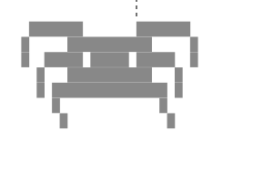

<pre>
████████╗ █████╗ ██████╗  █████╗ ███╗   ██╗████████╗ ██████╗  ██████╗ ███╗   ██╗
╚══██╔══╝██╔══██╗██╔══██╗██╔══██╗████╗  ██║╚══██╔══╝██╔═══██╗██╔═══██╗████╗  ██║
   ██║   ███████║██████╔╝███████║██╔██╗ ██║   ██║   ██║   ██║██║   ██║██╔██╗ ██║
   ██║   ██╔══██║██╔══██╗██╔══██║██║╚██╗██║   ██║   ██║   ██║██║   ██║██║╚██╗██║
   ██║   ██║  ██║██║  ██║██║  ██║██║ ╚████║   ██║   ╚██████╔╝╚██████╔╝██║ ╚████║
   ╚═╝   ╚═╝  ╚═╝╚═╝  ╚═╝╚═╝  ╚═╝╚═╝  ╚═══╝   ╚═╝    ╚═════╝  ╚═════╝ ╚═╝  ╚═══╝
</pre>

  <i>Structured like a production lab. Free-flowing like an indie manga studio.</i>

---

### The Studio

Tarantoon is an independent software collective focused on exploring the intersection of heavy engineering and raw creative design. We approach development the same way artists approach a blank canvas: establishing a rigorous underlying structure to support unconstrained, rule-breaking experimentation. 

Our architecture is deliberate. Our user experiences are rebellious.

### Ink & Canvas

  
  
  
  
  

### Current Drafts

*   **Interactive Narratives** - Digital experiences blending storytelling, immersive neo-brutalist interfaces, and experimental frontend logic.
*   **Terminal Utilities** - High-speed CLI tools forged for advanced text manipulation and workflow automation.
*   **Project Monolith** - An interactive web architecture leveraging next-generation frameworks and high-performance client-side rendering.

### Operating Parameters

<pre>
> Initializing Tarantoon Core...
> Loading studio modules...

[MODULE_NAME]               [STATUS]        [FOCUS_ALLOCATION]
Creative Architecture       ONLINE          ██████████ 100%
Terminal Experimentation    ONLINE          ███████░░░  70%
Narrative Design            COMPILING...    █████████░  90%
Legacy Maintenance          OFFLINE         ██░░░░░░░░  20%

> Studio resources optimized.
> Rule-breaking protocols engaged.
</pre>

---

  <i>"Building serious software without taking life too seriously."</i>

  

